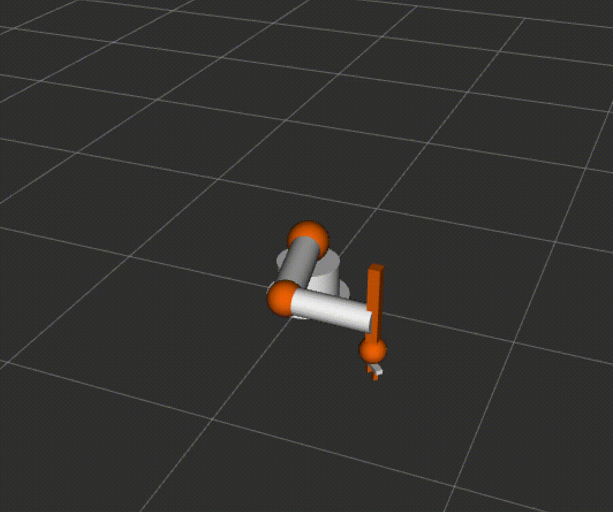

# ROS2 Jazzy - SCARA Robot Project

This is one of my personal project that aims to highlight the use of ROS2 Jazzy for robot programming.


## System Architecture

###

#### 1. `robot_bringup`
Main package for launching and configuring the robot system.
- **Launch Files**: `robot_system.launch.py` - Complete system launch configuration
- **URDF**: `scara_robot.urdf` - Robot description with 4 joints + gripper
- **Config**: `waypoints.json` - Predefined motion sequences
- **RViz**: Configuration files for visualization

#### 2. `robot_controller`
Core control package implementing robot kinematics and motion control.
- **robot_driver**: IK solver, joint interpolation, and state publishing
- **motion_publisher_node**: Waypoint-based mission execution


## Getting Started

### Prerequisites

- ROS2 Jazzy
- Ubuntu 24.04
- Dependencies:
  ```bash
  sudo apt install ros-$ROS_DISTRO-robot-state-publisher
  sudo apt install ros-$ROS_DISTRO-rviz2
  sudo apt install ros-$ROS_DISTRO-tf2-ros
  sudo apt install nlohmann-json3-dev
  ```

### Building the Project

1. Clone the repository:
   ```bash
   git clone https://github.com/becheanucornel/ROS2-Project---SCARA-Robot.git
   cd ROS2-Project---SCARA-Robot
   ```

2. Build the workspace:
   ```bash
   colcon build
   ```

3. Source the workspace:
   ```bash
   source install/setup.bash
   ```

## Running the System

### Launch Complete System

```bash
ros2 launch robot_bringup robot_system.launch.py
```

This will start:
- Robot driver node (IK solver and controller)
- Motion publisher (waypoint executor)
- Robot state publisher
- RViz2 visualization
- TF2 static transform broadcaster



*SCARA robot performing pick-and-place operations in RViz2*


## Waypoint System

### Waypoint Format (JSON)

The file which holds the waypoints the robot has to move to lives inside: "~/src/robot_bringup/config/".
Here the user can add, or modify the waypoints as he likes, by using the following structure:

```json
{
  "id": 1,
  "x": 0.9,
  "y": 0.0,
  "z": 0.2,
  "yaw": 0.0,
  "gripper": 0.0,
  "note": "Description"
}
```

**Fields:**
- `x, y, z`: Cartesian coordinates (meters)
- `yaw`: End-effector orientation (radians)
- `gripper`: 0.0 = open, 1.0 = closed
- `note`: Description of the movement
